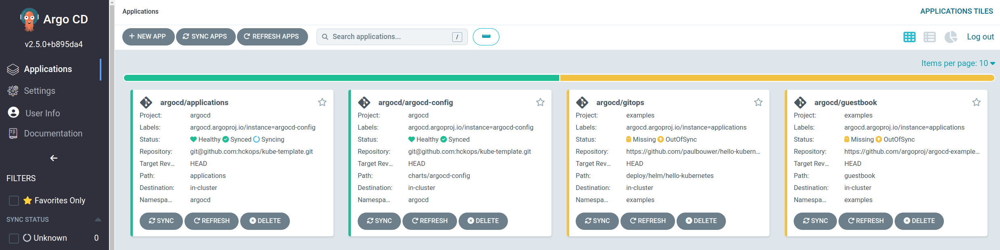

# kube-template

[](https://github.com/hckops/kube-template/actions/workflows/kube-do.yml)

> *Spin-up a platform with a git push!*

Setup
1. Create a new repository from this [template](https://github.com/hckops/kube-template/generate)
    - it works both with Public and Private repositories
    - naming convention: `kube-<CLUSTER_NAME>` or `<CLUSTER_NAME>-k8s`
2. Replace repository URL
    ```bash
    OLD_REPOSITORY=git@github.com:hckops/kube-template.git
    NEW_REPOSITORY=<HTTPS_OR_SSH_GIT_URL>

    grep -Rl --exclude=*.md --exclude-dir=.git ${OLD_REPOSITORY} . | xargs \
      sed -i "s|${OLD_REPOSITORY}|${NEW_REPOSITORY}|g"
    ```
3. Rename cluster name and definition `clusters/kube-<CLUSTER_NAME>.yaml`
    ```bash
    grep -Rl --exclude-dir=.git "test-do-lon1" . | xargs \
      sed -i "s|test-do-lon1|<CLUSTER_NAME>|g"
    ```
4. Override the credential template with the right owner
    ```diff
    # argocd-config/values-bootstrap.yaml
    + argocd.configs.credentialTemplates.ssh-creds.url: git@github.com:<OWNER_OR_REPOSITORY>
    - argocd.configs.credentialTemplates.ssh-creds.url: git@github.com:hckops
    ```
5. Add the following action secrets
    * `DIGITALOCEAN_ACCESS_TOKEN` required to privision a cluster with [DigitalOcean](https://cloud.digitalocean.com)
    - `GITOPS_SSH_KEY` and `ARGOCD_ADMIN_PASSWORD` required to bootstrap this platform with [ArgoCD](https://argo-cd.readthedocs.io/en/stable)
    - `DISCORD_WEBHOOK_URL` optional, to notify the status in a Discord channel
    - for more info see [workflow](.github/workflows/kube-do.yml) and [hckops/actions](https://github.com/hckops/actions)
6. Update the cluster definition and push all the changes
    ```diff
    # clusters/kube-<CLUSTER_NAME>.yaml
    + status: UP
    - status: DOWN
    ```
    or simply create the cluster by running
    ```bash
    make cluster-up
    ```
7. Wait... :rocket:

<p align="center">
  
</p>

8. Connect to ArgoCD
    ```bash
    DIGITALOCEAN_ACCESS_TOKEN=<MY_ACCESS_TOKEN>

    # download kubeconfig
    make kube-config token=${DIGITALOCEAN_ACCESS_TOKEN}

    # https://localhost:8080
    # [admin|<ARGOCD_ADMIN_PASSWORD>]
    make forward-argocd token=${DIGITALOCEAN_ACCESS_TOKEN}
    ```



9. Sample apps
    ```bash
    # http://localhost:8090
    kubectl --kubeconfig test-do-lon1-kubeconfig.yaml -n examples \
      port-forward svc/guestbook-ui 8090:80

    # http://localhost:8091
    kubectl --kubeconfig test-do-lon1-kubeconfig.yaml -n examples \
      port-forward svc/hello-kubernetes-gitops 8091:80
    ```
10. Alternatively, access the cluster from a container
    ```bash
    docker run --rm --name hck-tmp -it \
      -e KUBECONFIG=/root/.kube/config \
      -v ${PWD}/test-do-lon1-kubeconfig.yaml:/root/.kube/config \
      hckops/kube-argo
    
    # login with kubeconfig
    argocd login --core

    # list apps
    kubens argocd
    kubectl get applications
    argocd app list
    ```
11. Destroy the cluster
    ```bash
    make cluster-down
    ```
